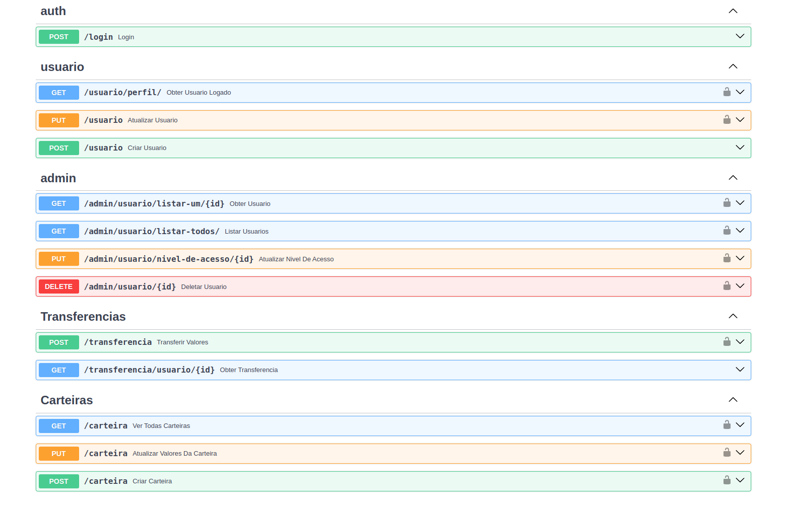

# Desafio Backend
Minha implementação do desafio backend proposto pela WL-Consultings: https://github.com/WL-Consultings/challenges/blob/main/backend/README.md

Usei meu boilerplate criado por mim como base para esse projeto: https://github.com/BrunoSiqueiraEstrela/api-boilerplate-python

### MOTIVOS

Uso do FastAPI: Usei o FastAPI por ser o framework onde tenho mais conhecimento no python e com meu boiler plate feito utilizando ele. Decidi utilizar meu boilerplate pois já havia feito a implementação de autenticação e autorização, e a arquitetura já estava pronta.


## Features

[x] Autenticação
[x] Criar um usuário
[x] Criar uma carteira
[x] Criar uma transferencia
[x] Consultar saldo da carteira de um usuário
[x] Adicionar saldo à carteira
[x] Criar uma transferência entre usuários (carteiras)
[x] Listar transferências realizadas por um usuário, com filtro opcional por período de data

## Requisitos

- Python 3.11
- Poetry
- Docker 
- MakeFile

- ---

## :computer: Como Executar o Projeto:
- Certifique-se de que não há nenhum serviço rodando na porta **8888** e **5432**, o serviço do **Postgres** e **Backend** serão executados em containers Docker.

- ---
1 - Entre na pasta do projeto e execute o comando:
```bash 
make docker-up
```
> Após a execução do comando acima, o projeto estará rodando na porta 8888. (Configurado no .env/.env.docker)

2 - Rodando as Migrations:
```bash 
make migration-upgrade
```
> Após a execução do comando acima, as tabelas serão criadas no banco de dados.

3 - Acesse o projeto em seu navegador:
```bash
http://localhost:8888
```
> Deve lhe redirecionar para a página de Documentação da API.

---
## Caso queira rodar o projeto localmente:
> Certifique-se de que o **Python 3.11** e o **Poetry** estão instalados em sua máquina.

1 - Entre na pasta do projeto e execute o comando:
```bash
pip install poetry
```

2 - Instale as dependências do projeto:
```bash
poetry install
```

3 - Inicialize o banco de dados:
```bash
make docker-db-up
```
> Após a execução do comando acima, o banco de dados estará rodando na porta 5432.


- Para encerrar o banco de dados, execute o comando:
```bash
make docker-db-down
```

4 - Execute as migrações:
```bash
make migration-upgrade
```

5 - Execute o comando para rodar o projeto:
> Recomendado utilizar o VSCode para rodar o projeto. (O mesmo já está configurado para rodar o projeto)

5.1 - Caso queira rodar o projeto via terminal, execute o comando:
```bash
poetry run uvicorn servidor.config:app
```


6 - Dados para testar:
> Para testar a API, utilize os dados abaixo:
> Cada usuario já possui uma carteira criada.
> Cada Carteira tem transferências realizadas.

- Usuário:
```json
{
    "email": "usuario1@email.com",
    "password": "password1"
},
{
    "email": "usuario2@email.com",
    "password": "password2"

}
```

- ---
## :wrench: Comandos Úteis
- Caso queira parar o projeto, execute o comando:
```bash
make docker-down
```

- Caso queira rodar os testes, execute o comando:
```bash
make run-tests
```

## Inspirações:

CosmicPython: https://www.cosmicpython.com/book/chapter_01_domain_model.html


